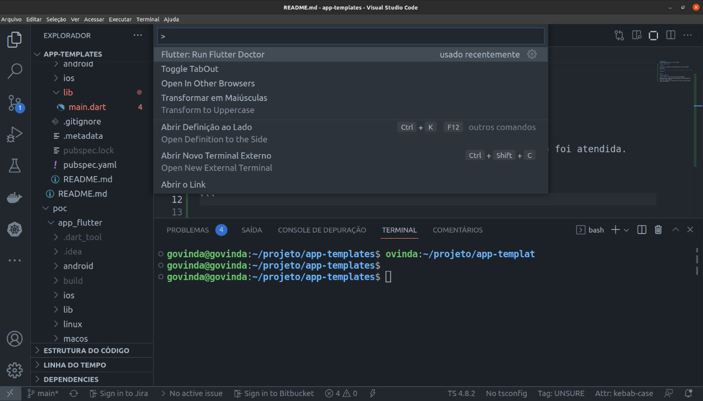
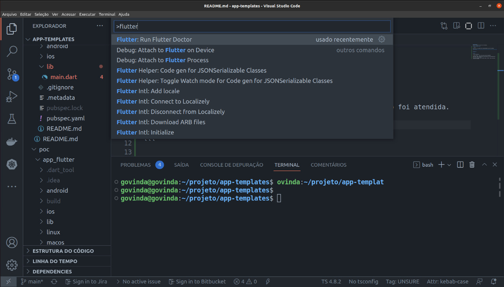
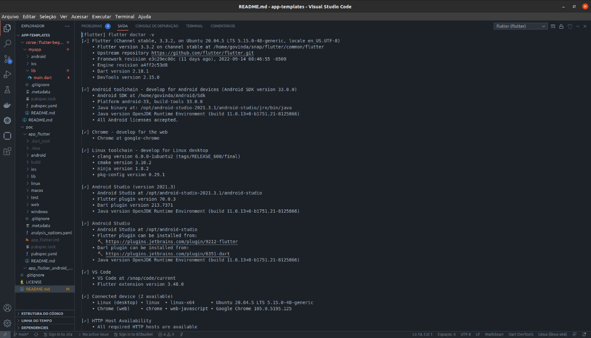
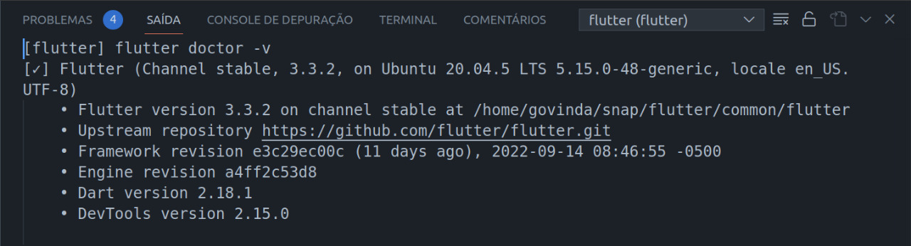
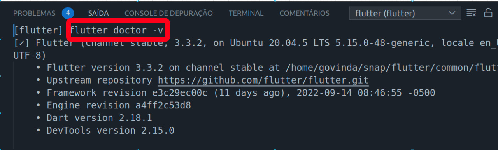
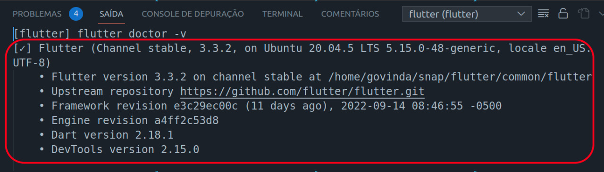
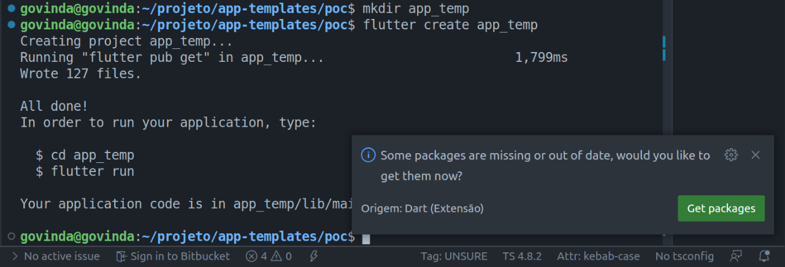
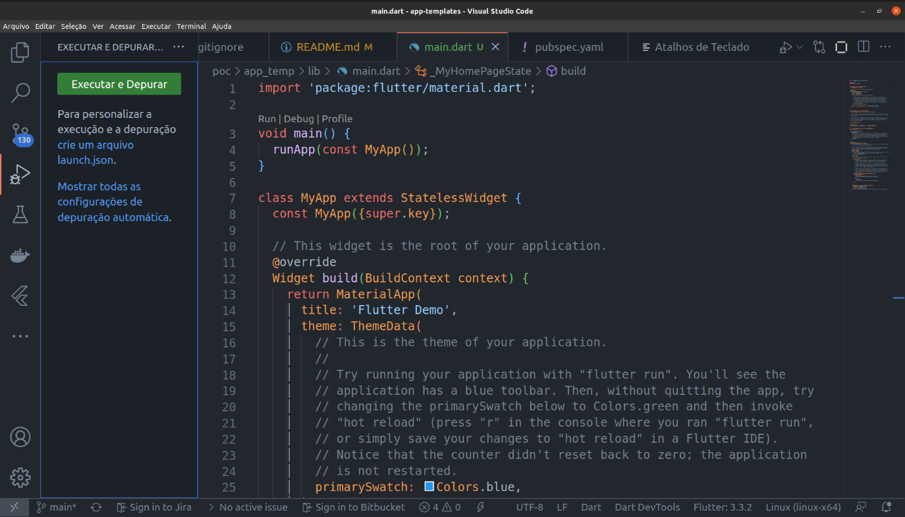
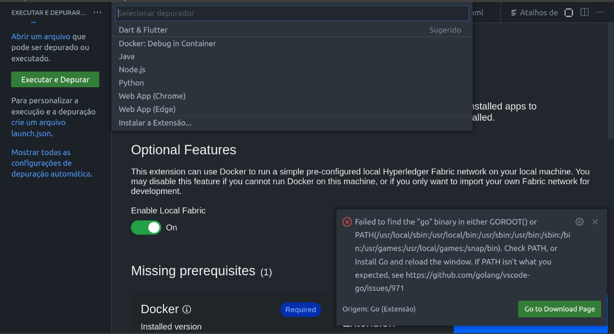
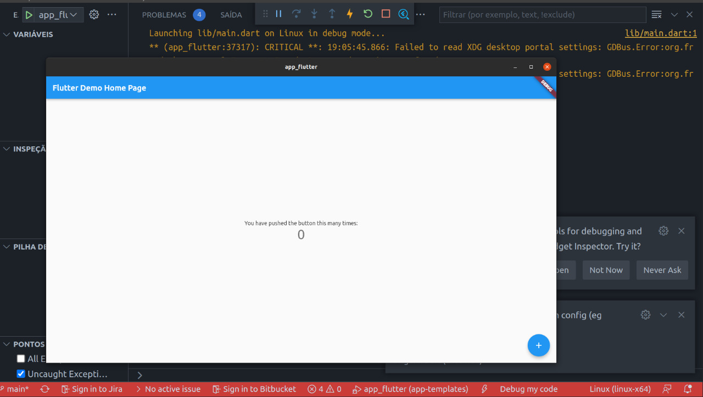

# app-templates
Projeto de templates de apps com várias tecnologias.

## Flutter como saber se estamos prontos ?

```flutter

# Verifica se no seu ambiente possui alguma dependencia que não foi atendida.

flutter doctor

```









^ Execução do comando "flutter doctor -v"



^ Como ler a resposta ? Em vermelho está o comando executado.



^ Item de checklist ok.

## Como criar um App ?

```flutter

# Cria um novo app

flutter create app_temp

```









^ digite na command palette do VS Code "Dart & Flutter"



## Congratulations your first App


## Links 

* Dart Language : https://dartpad.dev/?

* Flutter Tutorial :  https://www.youtube.com/watch?v=1ukSR1GRtMU

* Repo course : Repo : https://github.com/mitesh77/Best-Flutter-UI-Templates/tree/master/best_flutter_ui_templates

* Como criar um Projeto Flutter no Android Studio e VS Code : https://www.youtube.com/watch?v=t_fLik6Mjc4