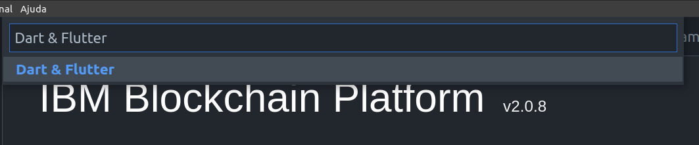

# app-templates
Projeto de templates de apps com várias tecnologias.

## Flutter como saber se estamos prontos ?

```flutter

# Verifica se no seu ambiente possui alguma dependencia que não foi atendida.

flutter doctor

```


^ Execução do comando "flutter doctor -v"


^ Como ler a resposta ? Em vermelho está o comando executado.


^ Item de checklist ok.

## Como criar um App ?

```flutter

# Cria um novo app

flutter create app_temp

```




^ digite na command palette do VS Code "Dart & Flutter"


## Congratulations your first App


## Links 

* Dart Language : https://dartpad.dev/?

* Flutter Tutorial :  https://www.youtube.com/watch?v=1ukSR1GRtMU

* Repo course : Repo : https://github.com/mitesh77/Best-Flutter-UI-Templates/tree/master/best_flutter_ui_templates

* Como criar um Projeto Flutter no Android Studio e VS Code : https://www.youtube.com/watch?v=t_fLik6Mjc4

## FeeDBack

Tecnologia muito promissora, porem achei cuir por padrão retornar os 3 códigos, mas tambem, admito que estou aprendendo com o Framework.

## My Profile Resume

| [<br><sub>Govinda</sub>](https://github.com/govinda777) |
| :---: |


<p align="left">

<a href="https://github.com/govinda777?tab=followers">

</a>

</p>

[](https://www.buymeacoffee.com/govinda777)


